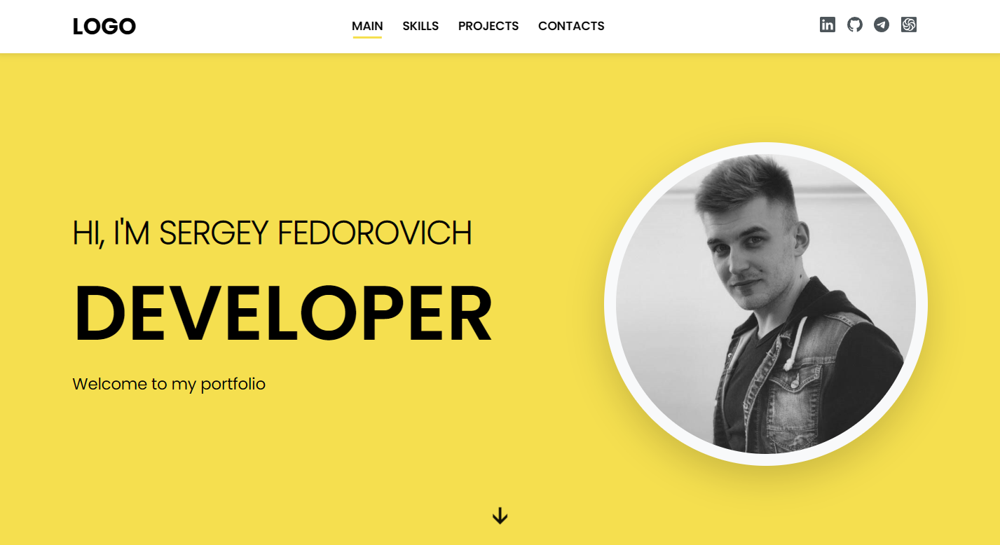

### Discover [My Portfolio](https://feddorovich.github.io/portfolio/) and Latest Project! 

Welcome to my repository, where you can find my portfolio created using TypeScript, React, Redux, React Router Dom, and other modern frontend development technologies.

I am a frontend developer with experience working on various projects, and in this portfolio, I showcase some of my best work. Here, you can find projects that I have built from scratch as well as those in which I participated as part of a team.

In my projects, I use best practices and strive to ensure high performance, accessibility, and ease of use. I believe that quality code should be readable, scalable, and easy to maintain.

Furthermore, I am open to new ideas and projects, and I am always ready to discuss new opportunities and challenges. I aim for constant growth and improvement of my skills, and I am willing to work with new technologies and tools.

Thank you for your interest in my portfolio!

#### [Demo](https://feddorovich.github.io/portfolio/)